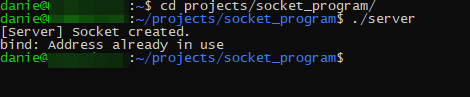

# Design Document

**Course**: CSCI 3550 – Communication Networks  
**Assignment**: 1 – Socket Programming  
**Author**: Danie Cunningham  
**Date**: June 20, 2025  

---

## 1. Introduction

This project implements a simple TCP client/server in C. The client reads an integer from the user, sends its name + integer to the server, waits for a reply (server name + integer), prints both names, numbers, and their sum, and exits. The server listens on a fixed port, serves one client at a time, sends back its own random integer, and shuts down if it ever sees an integer outside 1–100.

---

## 2. Architecture
```
   Client (bind:57476) ──TCP──> Server (listen:50072)
    │                                │
    └─ send {name, num}              └─ send {name, num}
```

- **Server port**: 50072  
- **Client port**: 57476  
- **Data**: fixed‐size struct with a 256-byte name and a 32-bit network-order integer.

---

## 3. Message Format

```c
struct message {
  char name[256];  // NUL-terminated
  int  number;     // htonl()/ntohl()
};
```

---

## 4. Client Workflow (`client.c`)

1. **Read Input**  
   Loop until `scanf("%d", &num)` succeeds (any integer accepted).
2. **Setup Socket**  
   `socket() → bind(...,57476) → connect(...,50072)`.
3. **Send Request**  
   Fill `struct message` with client name and `htonl(num)`, `write()`, log send.
4. **Receive Reply**  
   `read()`, `ntohl()` the number, compute sum, log reply and sum.
5. **Cleanup**  
   `close()` and exit.

---

## 5. Server Workflow (`server.c`)

1. **Setup Socket**  
   `socket() → setsockopt(SO_REUSEADDR) → bind(...,50072) → listen()`.
2. **Accept Loop**  
   - `accept()`  
   - `read() → ntohl() client_num`  
   - Log client/server names and `client_num`.  
   - If `client_num ∉ [1,100]`, log shutdown and break.  
   - Else pick `server_num = rand()%100+1`, compute sum, log both.  
   - Fill reply struct, `write()`, log send, `close(conn)`.
3. **Shutdown**  
   Close listen socket and exit.

---

## 6. Error Handling

- Check all `socket` API calls and `read`/`write`; on failure `perror()` then exit or continue.  
- Client re-prompts on non-integer input; out-of-range values are valid shutdown commands.  
- I/O routines verify complete transfer of `sizeof(struct message)` bytes.

---

## 7. Build & Run

```bash
gcc -o server server.c
gcc -o client client.c

# Terminal 1 (server):
./server &

# Terminal 2 (client):
./client [server_IP]   # defaults to 127.0.0.1
```

---

## 8. Testing Plan

1.  Valid exchange:
   - Enter 42 in client → server replies with random N → sum is correct.
   - 
   - 
2.  Shutdown signal:
   - Enter 0 or 101 → server logs shutdown and exits.
   - 
   - 
3.  Invalid input:
   - Enter abc → client re-prompts.
   - 
4.  Server not running:
   - Run client when server is stopped → client logs connect error.
   - 
5.  Port conflict:
   - Start two servers on the same port → second fails with bind error.
   - 

---

## 9. Possible Improvements

- Support multiple concurrent clients (`fork` or threads).   
- Secure with TLS (OpenSSL).  
- Make ports and names configurable via command‐line arguments.  
